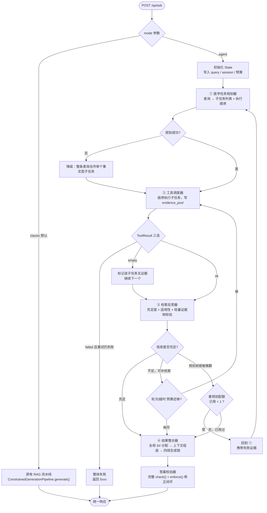

# 01 · 核心架构

执行流程、全局 State、状态流转规则与兜底机制。

---

## 一、执行流程图



**四个环节与任务书的对应**：① 任务规划 → ② 工具执行 → ③ 反思校验 → ④ 结果整合。
闭环体现在 `REFLECT → EXEC`（补检索）与 `REFLECT → PLAN`（重规划）两条回边上。

---

## 二、State 为什么是追加式

**结论：`rounds` 追加不改写，`evidence_pool` 共享可变。**

| | 可变 State | 追加式（本方案） |
|---|---|---|
| 内存 | 低 | 略高，但只多存引用 |
| 回放 / 调试 | 做不到 | 每轮快照可独立取出 |
| 「第 2 轮为什么补检索」 | 答不出（已被覆盖） | 直接读 `rounds[1].reflection` |

选追加式的理由不是调试方便，是**可复现性是这个系统的核心资产**。
现有 golden 评测之所以是唯一没有方差的尺子，靠的正是「同一份输入跑三轮、逐位可比」
这种性质。可变 State 会让 Agent 侧丧失同样的性质。

**内存代价可控**：大件是检索结果正文，不是元数据。所以 `Candidate` 只在
`evidence_pool` 里存一份（按 `chunk_id` 去重），各轮快照只存 `chunk_id` 列表。
按现有实测，一次检索 `rerank_pool=50`，3 轮上限即约 150 条引用，量级可忽略。

---

## 三、全局 State 数据结构

字段按任务书要求的八类组织。**生命周期**列的含义：
`初始化` = 建 State 时写一次不再改；`追加` = 每轮追加，历史不改写；
`可变` = 全程可更新（仅限池与计数器）。

### 3.1 顶层

```python
@dataclass
class AgentState:
    # ── 一、原始查询 ──────────────────────────────────────────
    request_id: str
    session_id: Optional[str]
    raw_query: str                     # 用户原话
    resolved_query: str                # 追问改写后（复用 FollowupRewriter）
    enhanced: Optional[EnhancedQuery]  # 复用 检索_查询理解.py 的结构化表示

    # ── 二、子任务列表 ────────────────────────────────────────
    plan: Optional[Plan]               # 当前生效的规划（重规划后被替换）
    plan_history: List[Plan]           # 追加：含被推翻的那一版及推翻理由

    # ── 三、工具调用历史 ──────────────────────────────────────
    tool_calls: List[ToolCall]         # 追加：每次调用一条，含入参、三态、耗时

    # ── 四、检索结果集 ────────────────────────────────────────
    evidence_pool: Dict[str, EvidenceEntry]   # 可变：chunk_id → 条目（含全局 marker）
    marker_seq: int                    # 可变：下一个可用的 [S#] 序号

    # ── 五、中间推理结论 + 六、反思记录 ───────────────────────
    rounds: List[RoundSnapshot]        # 追加：每轮一个快照，不改写

    # ── 七、合规校验结果 ──────────────────────────────────────
    constraint_report: Optional[Dict]  # 最终整合后写一次（FormatChecker.check() 原样）

    # ── 八、最终答案 ──────────────────────────────────────────
    final_answer: str
    sources: List[Dict[str, Any]]
    refusal_state: str                 # full_refusal / partial / substantive（由校验器判）

    # ── 控制与兜底 ────────────────────────────────────────────
    budget: Budget                     # 可变：轮次、重规划配额、超时
    status: str                        # running / done / aborted
    terminated_by: str                 # sufficient / budget_exhausted / timeout / tool_failure
    trace: List[Dict[str, Any]]        # 追加：给响应体 execution_trace 用的扁平事件流
```

### 3.2 逐字段表

| 字段 | 类型 | 写入方 | 生命周期 | 说明 |
|---|---|---|---|---|
| `request_id` | `str` | 入口层 | 初始化 | 复用现有 `request_id`，与日志、SQLite 记录一一对应 |
| `session_id` | `Optional[str]` | 入口层 | 初始化 | 复用 `SessionStore` |
| `raw_query` | `str` | 入口层 | 初始化 | 用户原话，永不改写 |
| `resolved_query` | `str` | 入口层 | 初始化 | 追问改写结果；复用 `FollowupRewriter.rewrite()` |
| `enhanced` | `EnhancedQuery` | 工具调度器 | 初始化 | 复用现有结构；`entities` 供规划器判类型 |
| `plan` | `Plan` | 规划器 | 可变（至多替换 1 次） | 当前生效规划 |
| `plan_history` | `List[Plan]` | 规划器 | 追加 | 含被推翻的版本与 `superseded_reason` |
| `tool_calls` | `List[ToolCall]` | 工具调度器 | 追加 | 每次调用一条，含三态结果 |
| `evidence_pool` | `Dict[str, EvidenceEntry]` | 工具调度器 | 可变（只增不减） | **全局唯一的证据池**，marker 在此分配 |
| `marker_seq` | `int` | 工具调度器 | 可变 | 单调递增，**编号不复用** |
| `rounds` | `List[RoundSnapshot]` | 反思器 | 追加 | 每轮的推理结论与反思记录 |
| `constraint_report` | `Dict` | 答案校验器 | 最终写一次 | `FormatChecker.check()` 的返回原样存 |
| `final_answer` | `str` | 结果整合器 → 校验器修正后覆盖 | 最终 | 修正过程记在 `constraint_report` |
| `sources` | `List[Dict]` | 结果整合器 | 最终 | 形状与现有 `SourceItem` 一致 |
| `refusal_state` | `str` | 答案校验器 | 最终 | **由代码判，不由 Agent 自称** |
| `budget` | `Budget` | 编排器 | 可变 | 见 §5 |
| `status` / `terminated_by` | `str` | 编排器 | 可变 | 终止原因，进响应体 |
| `trace` | `List[Dict]` | 各组件 | 追加 | 扁平事件流，Agent 模式额外返回 |

### 3.3 子结构

```python
@dataclass
class SubTask:
    task_id: str                       # t1 / t2 …
    intent: str                        # 子任务要回答什么（自然语言，进检索）
    entities: List[str]                # 该子任务锚定的实体（药名/试验名/人群）
    constraints: Dict[str, Any]        # 人群、终点、年份等；供适用性检查比对
    depends_on: List[str]              # 空 = 可并行；非空 = 串行，等前置完成
    status: str                        # pending / ok / empty / not_applicable / failed
    evidence_ids: List[str]            # 命中的 chunk_id，指向 evidence_pool

@dataclass
class Plan:
    strategy: str                      # factual / comparative / temporal_causal
    rationale: str                      # 为什么这么拆（进 trace，便于事后判断规划质量）
    subtasks: List[SubTask]
    created_at_round: int
    superseded_reason: Optional[str]   # 被重规划推翻时填

@dataclass
class ToolCall:
    call_id: str
    round_no: int
    task_id: str
    tool: str                          # retrieval.search / query.understand
    params: Dict[str, Any]             # 真实入参，可据此原样重放
    status: str                        # ok / empty / failed        ← 三态，见 02·二
    n_results: int
    error_code: Optional[int]          # failed 时映射到现有错误码
    seconds: float
    cache_hit: bool

@dataclass
class EvidenceEntry:
    chunk_id: str
    marker: str                        # 全局唯一 [S#]，一经分配永不变更
    candidate: Any                     # 现有 Candidate 对象
    first_seen_round: int
    from_tasks: List[str]              # 哪些子任务命中了它（可能多个）
    applicability: Optional[Dict]      # 适用性检查结果，见 §4.3

@dataclass
class RoundSnapshot:
    round_no: int
    executed_tasks: List[str]
    new_evidence_ids: List[str]        # 本轮新增的 chunk_id（不含此前已有的）
    reasoning: str                     # 中间推理结论
    reflection: Dict[str, Any]         # 反思器输出，见 02·四
    checks: Dict[str, Any]             # 轻量证据侧校验结果，见 §4
    decision: str                      # sufficient / need_more / replan
    seconds: float
```

---

## 四、每轮做哪些检查（以及为什么不做完整校验）

### 4.1 分工

| 检查 | 何时跑 | 依据 |
|---|---|---|
| 引用编号越界（`citation.invalid_number`） | **每轮** | 不依赖章节结构，中间态就能算 |
| 数字未溯源（`numeric.ungrounded`） | **每轮** | 同上 |
| **证据适用性**（人群 / 终点匹配） | **每轮** | 见 4.2，整合后修不了 |
| 三态拒答判定 | 仅最终 | 针对最终答案定义 |
| 章节完整性 / 参考文献完整性 | 仅最终 | 中间态必然缺失 |
| 术语缩写全称 | 仅最终 | 同上 |

**为什么不每轮跑完整 `check()`**：那些判据是针对最终答案定义的，中间轮次没有
「## 参考文献」一节，跑完整校验只会得到一堆必然违规。
**拿终态判据去量中间态，测出来的是判据的错配**，不是系统的问题。

### 4.2 证据适用性为什么必须在轮内

这一类的特点是**整合阶段修不了**：

发现 HFrEF 试验的效应量被用来回答 HFpEF 问题时，整合阶段能做的只有删掉那句话，
而正确动作是**回去补检索**——那必须在轮内发现，否则轮次预算已经用完。

对照：格式违规（缺章节、缩写没全称）整合后修得了，所以放最终无妨。
**判据的位置由「发现得晚还来不来得及救」决定，不由「哪里方便」决定。**

### 4.3 适用性检查的输出

```python
{
  "chunk_id": str,
  "verdict": "applicable" | "mismatched" | "unknown",
  "dimension": ["population", "endpoint", "timeframe"],   # 哪一维不匹配
  "evidence": {                       # 双路查，必须并列，缺一路不算查过
      "by_name":  {...},              # 按试验名 / 人群名查
      "by_value": {...},              # 按效应量数值查
  },
  "reason": str,
}
```

⚠ **双路并列不可省。** 现有系统踩过：判据写「DAPA-HF 未被当作 HFpEF 证据」，
按试验名查——模型一个字没提 DAPA-HF，只搬了它的效应量 `HR 0.74 (0.65–0.85)`，
**判据直接绿了**。名义查了、实质没查，是空洞断言的第三种形态。
所以适用性检查必须同时按名义（试验名/人群名）和按实质（效应量数值）各查一条。

---

## 五、状态流转规则

### 5.1 分支判定

| 从 | 到 | 条件 |
|---|---|---|
| 规划 | 执行 | 规划成功，或规划失败后降级为单子任务 |
| 执行 | 反思 | 本轮所有子任务执行完（含 `empty` / `not_applicable`） |
| 执行 | **整体失败** | 工具 `failed` 且重试 1 次仍失败 |
| 反思 | **整合** | ① 信息充足；或 ② 轮次耗尽；或 ③ 超时；或 ④ 已用过重规划配额且仍不足 |
| 反思 | 执行 | 信息不足 **且** 缺口可由补检索填补 **且** 预算未耗尽 |
| 反思 | **规划** | 规划前提被证据推翻 **且** 重规划配额未用 |

**「什么条件下从执行回到规划」**：不直接回。执行只把结果交给反思，
由反思器判定是否属于「规划前提被推翻」。这样保证回边只有一个判定点，
不会出现两处各自判、行为不一致。

**「什么条件下从反思直接进整合」**：上表四条中任一成立。
注意 ②③④ 是**兜底路径**——它们进整合时证据可能不足，最终由校验器判成
`partial` 或 `full_refusal`，这正是三态语义要覆盖的情形。

### 5.2 规划前提被推翻的判定

只认两种，避免这条回边被滥用：

**1. 实体疑似不存在** —— 三个条件**同时**成立才算：

```
a. ToolResult.status == "empty"        # 检索成功但零命中，不是 failed
b. 该子任务已至少补检索过一次           # 首轮零命中不足以判定
c. 宽池复查（rerank_pool ≥ 200）仍零命中
```

⚠ **零命中不等于不存在，这条必须写死。** 本项目已经量过两次：

- golden 集 T1 有 **27.8% 的目标块「连 200 条候选池也没有」**，
  而那些 ground truth **按构造全部在库**——所以零命中的首要解释是检索没捞到，不是不存在。
- P0 的三分法（不在 oa_comm ／ 在库但关键段落没被抽中 ／ 被抽中但排不上去）
  整套方法就是为了区分这三种情况而做的。

条件 c 用 `rerank_pool ≥ 200` 也是现成结论：**小池子分不开「不在候选池」与
「进了池被压下去」**，只有宽池导出的 `fused_rank` / `final_rank` 才分得开
（生产默认 50 是为效果，诊断必须开到 200+，两个用途不合并）。

**为什么把门槛抬这么高**：这条回边的产物是对用户说「你的前提有误，该试验可能不存在」。
**把一个真实存在的试验说成不存在，在医学场景下是危险方向**——
它比拒答更糟，因为它带着确定性的语气给出了错误信息。
宁可多花一轮检索，也不要用一次零命中就下这个结论。

⚠ 即使三条全中，措辞也应是「在本知识库中未检索到」而非「该试验不存在」——
知识库的边界不等于世界的边界。这与现有 `DocNotFound` 的措辞约定同源
（「不在目录里」≠「PMC 上没有这篇」）。

**2. 前提与证据冲突** —— 题面断言某试验达到主要终点，而检索到的证据明确写未达到。
这条不需要额外门槛：它有正面证据支撑，不是由「没找到」推出来的。

其余情况（证据少、质量差、不够新）一律走「补检索」，不走重规划。

### 5.3 重规划的闸门

```python
budget.replan_used < budget.replan_max          # replan_max = 1，全局
and reflection.decision == "replan"
and reflection.replan_evidence is not None      # 必须携带结构化失败证据
```

三条同时成立才允许。重规划请求携带的证据写进 `Plan.superseded_reason`，
新 `Plan` 追加进 `plan_history`——**旧规划不删**，否则「为什么改了规划」无从查证。

第二次仍失败（新规划执行后反思器再次判 `replan`）时，**不再给配额**，直接进整合，
按现有规矩由校验器判拒答。

---

## 六、兜底机制

### 6.1 最大迭代轮次 = 3

依据来自现有实测，不是拍的：

| 环节 | 实测耗时 | 来源 |
|---|---|---|
| 单次检索（含融合与重排） | 约 0.5 s | 现有 live 模式实测 |
| 中译英（LLM 整句） | 约 5 s | 同上 |
| 四段生成链 | 约 30~40 s | 同上 |
| 同步单轮问答总计 | 34~46 s | 阶段十实测 |

Agent 模式的估算：规划 1 次 LLM（约 5 s）+ 每轮（检索 0.5 s + 反思 1 次 LLM 约 5~8 s）
+ 最终整合走完整四段链（30~40 s）。

| 轮次 | 估算总耗时 |
|---|---|
| 1 | 约 45 s |
| 2 | 约 53 s |
| **3** | **约 62 s** |
| 4 | 约 70 s |
| 5 | 约 79 s |

取 3 的理由：**3 轮的耗时（约 62 s）仍在现有单轮问答的量级内（34~46 s）**，
运维经验、超时配置、客户端预期都不必推翻重来。再往上收益递减而尾延迟明显变差。

⚠ 这是**基于既有耗时的估算，不是 Agent 实测值**。有真实用例后应重新量，
特别是反思器那一次 LLM 调用的实际耗时。

### 6.2 超时：单轮与全局都要有

**全局包络 180 s，内部切成「迭代预算 140 s + 整合窗口 40 s」。**

| 层级 | 上限 | 超时后 |
|---|---|---|
| 单次工具调用 | 30 s | 记 `ToolCall.status = "failed"`，走重试 1 次 |
| 单次 LLM 调用（规划/反思） | 60 s | 该环节失败：规划失败 → 降级；反思失败 → 按「信息充足」进整合 |
| 单轮（执行 + 反思） | 90 s | 中断本轮，进整合 |
| **迭代阶段合计**（规划 + 全部轮次） | **140 s** | 中断迭代，带已有证据进整合 |
| 整合 + 校验窗口 | 40 s（预留，不额外计时） | 见下 |
| **全局包络** | **180 s** | = 140 + 40 |

**为什么把整合窗口从预算里预留出来，而不是让它超出预算**：
超时**不跳过整合与校验**（下面那条硬规矩），所以整合必然要跑。
若迭代预算就吃满 180 s，再叠加 30~40 s 的四段链，实际上界会变成 220 s——
那是一个**没写在任何地方的隐含常数**，而客户端超时正是照着文档配的。
把窗口预留进来，180 s 这个数才是它字面的意思。

40 s 的依据：四段链实测 30~40 s（现有 live 模式数据），取上界。

**超时后已有结果怎么处置——这条要写死**：

> 迭代超时**不跳过整合与校验**，而是带着已有证据走完 ④ 与校验器。

理由：直接返回半成品会绕过三态判定与引用校验，产出一个没有经过任何合规检查的答案。
宁可答「基于已检索到的部分证据……」并被判成 `partial`，也不要一个未经校验的输出。

响应体标记 `terminated_by = "timeout"`，`execution_trace` 里保留已完成的轮次。

**这个包络保证什么、不保证什么**（客户端照这个配超时）：

| | 值 | 性质 |
|---|---|---|
| 迭代阶段 | ≤ 140 s | **硬上限**：编排器自己计时，到点中断 |
| 典型总耗时 | 约 62 s（3 轮）～ 180 s | 迭代 + 一次正常的四段链 |
| 整合阶段的上界 | 由各段 LLM 自身超时决定 | **不是硬上限**：单段最坏 `timeout=180 s`（现有 `MedicalGenerationPipeline` 默认） |

⚠ **整合段不设独立中断**：一旦中断它，就回到「未经校验的答案」那个自相矛盾的结果。
所以 180 s 是**设计包络不是硬超时**——模型端异常卡住时仍可能超出。

**客户端超时建议：300 s**，与现有部署文档给 classic 模式的建议一致
（「一次问答要一百多秒是正常的，客户端超时设到 300 秒以上；或走流式」），
Agent 模式不需要另配一个数。

### 6.3 迭代中途失败时状态怎么收场

| 失败点 | 收场 |
|---|---|
| 规划器失败（模型不可用 / JSON 解析失败） | **降级**：整条查询当作单个事实型子任务，继续执行。记 `trace` |
| 工具 `failed`（重试后仍失败） | **整体失败**：`status = "aborted"`，返 `4001` / `5002`，不产出答案 |
| 工具 `empty` | 不算失败：标记子任务 `status = "empty"`，继续 |
| 反思器失败 | **按「信息充足」处理**，进整合。保守方向：宁可少一轮检索，不要因反思器挂掉而空转 |
| 结果整合器失败 | 整体失败，返 `5001` |
| 校验器失败 | 返回**未经校验**的答案，但响应体 `constraint_check = null` 并在 `detail` 写明。不静默假装合规 |

**原则**：能降级的降级并留痕，不能降级的明确失败。
**任何一条都不产出「看起来正常但实际没走完流程」的响应**——那是现有系统里
「错误码全变 5001 而响应体看起来完全正常」那个坑的 Agent 版。

---

## 七、三态拒答在 Agent 模式下怎么判

**判定时机**：只在最终整合后，由现有 `FormatChecker.check_refusal()` 判一次，
作用域仍是「核心答案」一节。**语义与单轮模式完全一致，不新增状态。**

**Agent 提供期望值，但不覆盖判定**：

| 子任务证据状态 | 期望 `refusal_state` |
|---|---|
| 全部子任务 `empty`（查了，什么都没有） | `full_refusal` |
| 含 `not_applicable`（找到了，但不适用于所问人群/终点） | `partial` |
| 部分有证据、部分 `empty` | `partial` |
| 全部有证据 | `substantive` |

⚠ **`empty` 与 `not_applicable` 不能合并映射。** 证据不适用意味着
「找到了，但不能用于你问的人群」——**这本身就是可以告诉用户的信息**，不是无话可说。

典型形状：问 HFpEF 的 SGLT2i 证据，检索到 DAPA-HF（HFrEF 人群）。
正确回答是「HFrEF 人群有此数据，但不能外推到 HFpEF」，
而不是「根据现有文献无法回答」。前者给了用户真实且有用的信息并明确了边界，
后者把一次成功的检索浪费掉了。

这也正是外部评测里失分的那个形状的反面：把 HFrEF 数据**直接拿来答** HFpEF 是错的，
但把它**标注清楚人群后说明不可外推**是对的——两者的差别不在于用没用这条证据，
在于有没有说清它的适用边界。

期望值写进 `trace`，与校验器的实际判定比对：
**不一致时记录差异，但以校验器为准**。这条沿用现有原则——判定必须由代码给，
Agent 说自己「充分回答了」不作数。

⚠ 期望值不写进提示词（与现有 `expect_refusal` 的处理一致：仅评测用，
只影响校验口径，绝不写进提示词），否则等于告诉模型「你应该拒答」，
测出来的是提示词的服从性，不是系统的判别力。

---

## 八、`[S#]` 编号在多轮下怎么不串号

**问题**：现在编号由单次 `assemble_context()` 内部顺序生成。多轮各自组装，
第 1 轮的 `[S3]` 与第 2 轮的 `[S3]` 会指向不同文献。

**方案：编号在 State 层全局分配，绑定 `chunk_id`。**

```
证据首次进入 evidence_pool 时：
    marker = f"S{state.marker_seq}"
    state.marker_seq += 1
    entry.marker = marker            # 此后永不变更、永不复用

最终整合时：
    把带 marker 的 EvidenceEntry 交给 ContextAssembler
    组装器按传入的 marker 渲染，不自行生成
```

三条不变量：

1. **同一 `chunk_id` 在整个会话内只有一个 marker**（多个子任务命中同一块时共用）。
2. **marker 一经分配不复用**，即使该证据后来被筛掉——与现有「筛掉证据后不重编号」
   同一原则（重编会让 `citations` 映射失效、复跑日志对不上）。
3. **最终答案里的编号可能不连续**（如 `[S1][S4][S7]`），这是可接受代价，现有系统已如此。

**落地成本**：`ContextAssembler` 需扩展一个「接受外部 marker 映射」的入口。
现有 `format_block(chunk, marker, body=None)` 已经把 marker 作为参数接收，
扩展点很浅——改的是 `assemble_context()` 里生成 marker 那一段，不动渲染逻辑。

**引用校验不受影响**：`citation_check` 的 used / available / fabricated 三个集合
仍由现有 `postprocess()` 算，只是 available 变成全局池里被选中的那批。
