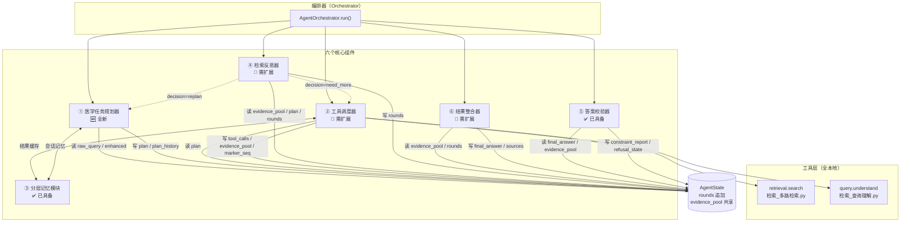

# 02 · 组件接口

六个组件的职责边界、接口签名、依赖关系与异常路径。

签名风格照现有代码：类型标注 + 默认值，返回 `Dict[str, Any]` 或 dataclass。
凡标「已具备」的，签名均由 AST 从现有源码抽取后照抄，不重新发明。

---

## 一、依赖关系图



**读写约束**：`evidence_pool` 与 `marker_seq` **只有工具调度器写**，
其余组件只读。这是编号唯一性的保证——多个写入方会让 marker 分配失去单点。

---

## 二、工具层的返回契约（先定这个，六个组件都依赖它）

```python
@dataclass
class ToolResult:
    """工具调用的统一返回。**三态显式区分，不许用空列表兼表两种情况。**

    status 的语义：
      ok     —— 调用成功，且有结果（data 非空）
      empty  —— 调用成功，但没有命中（data 为空，这是**信息**）
      failed —— 调用本身失败（超时/异常/依赖不可用，data 无意义）
    """
    status: Literal["ok", "empty", "failed"]
    tool: str
    data: Any = None
    n_results: int = 0
    error_code: Optional[int] = None     # failed 时映射到现有 ErrorCode
    error_message: str = ""
    seconds: float = 0.0
    cache_hit: bool = False
    raw_params: Dict[str, Any] = field(default_factory=dict)   # 可据此原样重放
```

**为什么升格为契约而不只是约定**：这个混淆在单轮系统里只是答得差，
在 Agent 模式里会让整条推理链走错——反思器看到空结果会判「信息不足，补检索」，
而实际是检索器崩了，补多少次都是空，直接烧完最大轮次。

与三态拒答同理：**空不等于没有，失败不等于空。**

**已注册工具**（全离线，无外部 API）：

| 工具名 | 底层 | 入参 | `ok` 时的 data |
|---|---|---|---|
| `retrieval.search` | `RetrievalPipeline.search()` | `query, top_k, rerank_pool, fusion_strategy, use_landmark, …` | `search()` 的返回 dict |
| `query.understand` | `MedicalQueryProcessor.process_query()` | `query` | `EnhancedQuery` |

---

## 三、① 医学任务规划器 🆕 全新

**职责**：把一句用户查询变成结构化子任务列表与执行顺序。

### 接口

```python
class MedicalTaskPlanner:
    def __init__(self,
                 generator: Any = None,              # 复用 LLMGenerator / CachedLLMGenerator
                 max_subtasks: int = 4,
                 temperature: float = 0.0,           # 确定性：规划要可复现
                 max_tokens: int = 800):
        ...

    def plan(self,
             query: str,
             enhanced: Optional[EnhancedQuery] = None,
             history: Optional[List[Dict[str, Any]]] = None,
             replan_evidence: Optional[Dict[str, Any]] = None) -> Plan:
        """查询 → 子任务列表 + 执行顺序。

        replan_evidence 非空即为重规划：必须携带上一版规划失败的结构化证据，
        提示词里明写「上一版为什么不成立」，避免模型原样再拆一遍。
        """
```

### 三种拆解策略与判据

**判据优先用结构化信号，模型只在信号不足时兜底**——这样规划本身可复现，
不完全依赖模型输出的稳定性。

| 策略 | 判据（按序判，先命中先用） | 拆法 | 依赖 |
|---|---|---|---|
| **comparative** 比较型 | `enhanced.entities` 里同一 `etype` 的实体 ≥ 2，**且**查询含比较触发词（比较 / vs / 哪个更 / 差异 / 优于） | 每个实体一个子任务，`depends_on = []`（并行） | `EnhancedQuery.entities`，无需新写 NER |
| **temporal_causal** 时序因果型 | 查询含时序/因果触发词（先后 / 之后 / 导致 / 机制 / 为什么 / 进展），**或**含年份区间 | 拆成串行链，后一个子任务 `depends_on` 前一个 | 触发词表 + `enhanced.filters` 里的年份 |
| **factual** 事实型 | 上面两条都不命中（**默认**） | 不拆，单子任务直答 | — |

**判据落在哪**：前两条的第一半来自 `EnhancedQuery`（现成的实体识别与过滤条件抽取），
第二半是一张触发词表。两条都不命中就走默认，**不存在「判不出来」的情况**。

⚠ **不穷举医学问题类型。** 剂量计算、鉴别诊断、指南比对等更细的类型留待有真实用例时再加，
本轮明确列为未定项（见 README · 四）。

### 输出

`Plan`（结构见 `01_核心架构.md` §3.3），关键是 `rationale` 字段——
写清为什么这么拆，进 `trace`，事后可判断规划质量。

### 依赖

- **依赖**：`LLMGenerator`（可选，判据够用时不调模型）、`EnhancedQuery`、分层记忆（读会话历史）
- **被依赖**：编排器；反思器通过 `decision="replan"` 间接触发

### 异常路径

| 情况 | 处置 |
|---|---|
| 模型不可用 / 超时 | **降级**：整条查询当作单个 `factual` 子任务，`Plan.strategy = "factual"`，`rationale` 写明「规划器降级」 |
| 模型返回非法 JSON | 复用现有 `normalize_quirks` 修引号畸形；仍失败则重试 1 次并回灌具体报错（现有做法：温度 0 时原样重发无效）；再失败则降级 |
| 拆出 > `max_subtasks` 个 | 截断到上限，`rationale` 记录被截掉几个 |
| 拆出 0 个 | 视为降级，走单子任务 |

---

## 四、② 工具调度器 🔧 需扩展

**职责**：把子任务翻译成工具调用，统一管理注册、参数校验、执行、重试与结果入池。

### 接口

```python
class ToolDispatcher:
    def __init__(self,
                 registry: Optional[Dict[str, ToolSpec]] = None,
                 cache: Optional[GenerationCache] = None,   # 复用 生成_缓存.py
                 max_retries: int = 1,                      # 仅对 failed 重试
                 timeout_seconds: float = 30.0):
        ...

    def register(self, spec: ToolSpec) -> None:
        """注册一个工具：名字、可调用对象、参数模型、是否可缓存。"""

    def execute(self, task: SubTask, state: AgentState) -> ToolResult:
        """执行单个子任务。内部：参数校验 → 查缓存 → 调工具 → 入池 → 记 ToolCall。"""

    def execute_batch(self, tasks: List[SubTask], state: AgentState) -> List[ToolResult]:
        """按 depends_on 分批：无依赖的并行，有依赖的串行等待。"""


@dataclass
class ToolSpec:
    name: str
    fn: Callable[..., Any]
    param_model: Any                    # pydantic 模型，复用现有参数校验风格
    cacheable: bool = True
    timeout_seconds: float = 30.0
```

### 已有基础 vs 需扩展

| 部分 | 状态 | 说明 |
|---|---|---|
| 主工具本体 | ✅ | `RetrievalPipeline.search()` 参数已足够丰富（`top_k` / `rerank_pool` / `fusion_strategy` / `use_landmark` 均可按子任务调） |
| 结果缓存 | ✅ | `GenerationCache.get_or_compute()` 就是「查缓存→未命中才调」；`namespace` 支持按工具分区 |
| 参数校验 | ✅ 风格已有 | 复用现有 pydantic 请求模型的写法（`ge` / `le` / `max_length`） |
| 异常收敛 | ✅ | 复用 `classify_exception(exc) -> APIError`，直接得到 `error_code` |
| **工具注册表** | 🔧 | 现在没有「工具」这个抽象，检索是被直接调用的 |
| **`ToolResult` 三态** | 🔧 | 现在 `search()` 成功即返回 dict，空结果与失败不区分 |
| **重试策略** | 🔧 | 现有重试只在 LLM JSON 解析处，检索侧没有 |

### 缓存键怎么定

复用现有 `make_key(query, context, **params)`，但 **`params` 必须含全部影响结果的检索参数**
（`top_k` / `rerank_pool` / `fusion_strategy` / `use_landmark`）。
否则同一 query 用不同池子跑会误命中——这是「缓存键漏参数」的经典形态。

⚠ 现有 `GenerationCache` 的温度门限默认 `max_temperature = 0.0`（只缓存确定性输出）。
检索工具本身是确定性的（已实测：同一输入三轮 47,400 个分数逐位相同），
所以传 `temperature=0.0` 即可正常缓存。**规划/反思若用非零温度则不会被缓存**，这是既定行为。

### 依赖

- **依赖**：工具层、分层记忆（缓存）、`服务_错误码.py`
- **被依赖**：编排器；反思器通过 `decision="need_more"` 间接触发

### 异常路径

| 情况 | 处置 |
|---|---|
| 参数校验失败 | 不调工具，直接 `ToolResult(status="failed", error_code=1001)`。**不重试**（参数错重试也错） |
| 工具抛异常 | `classify_exception()` → `error_code`；重试 1 次；仍失败则 `failed` |
| 工具超时（30 s） | 同上，`error_code = 4002` |
| 工具返回空结果 | **`status="empty"`，不是 failed，也不是 ok**。这是本契约的核心 |
| 依赖缺失（向量库 / BM25 目录不存在） | `error_code = 3004`（`INDEX_NOT_READY`），**不重试**——重试救不了缺文件 |

---

## 五、③ 分层记忆模块 ✅ 已具备

**职责**：两层记忆——跨请求的会话记忆、跨轮次的工具结果缓存。

### 接口（直接复用，签名照抄）

```python
# 会话记忆 —— 服务_会话.py
SessionStore(db_path=DB_PATH, ttl_days=30.0, timeout=10.0)
    ensure(session_id) -> Tuple[Dict[str, Any], bool]
    history(session_id, max_turns=4) -> List[Dict[str, Any]]        # 时间正序
    append_turn(session_id, role, content, request_id="", meta=None) -> int
    purge_expired(ttl_days=None) -> int

FollowupRewriter(generator=None, max_tokens=120, temperature=0.0, history_turns=4)
    rewrite(query, history, mode="llm") -> Dict[str, Any]

# 工具结果缓存 —— 生成_缓存.py
GenerationCache(max_entries=256, max_bytes=64*1024*1024,
                ttl_seconds=7*24*3600, max_temperature=0.0,
                path=None, namespace="", verbose=False)
    make_key(query, context="", **params) -> str
    get_or_compute(key, factory, temperature=None, meta=None) -> Tuple[Any, bool]
    info() -> Dict[str, Any]
```

### Agent 侧只需两条约定（不改代码）

1. **缓存分区**：工具结果用 `namespace="tool:<工具名>"`，与生成缓存分开，
   避免 Agent 的检索缓存把 LLM 生成缓存挤出容量上限。
2. **轨迹挂载**：Agent 执行轨迹写进 `append_turn(..., meta={"agent_trace": ...})`。
   `turns` 表已有 `meta` TEXT 字段（JSON），**不必改表结构**。

### 依赖

- **依赖**：无（最底层）
- **被依赖**：规划器（读历史）、工具调度器（缓存）、入口层（追问改写）

### 异常路径

| 情况 | 处置 |
|---|---|
| SQLite 写失败 | 复用现有 `StorageError`（`5004`）。**会话写失败不阻断问答**——记 `trace` 后继续，历史丢一轮好过整个请求失败 |
| 缓存文件损坏 | `load()` 现有行为：过期条目直接丢掉。损坏则视为空缓存，不阻断 |
| 会话不存在 | `ensure()` 现有行为：不存在就建 |

---

## 六、④ 检索反思器 🔧 需扩展

**职责**：看已有证据够不够回答子任务，输出充足度判断、适用性判定与下一步建议。

### 接口

```python
class RetrievalReflector:
    def __init__(self,
                 generator: Any = None,
                 checker: Optional[Any] = None,     # 复用 FormatChecker 的证据侧子集
                 temperature: float = 0.0,
                 max_tokens: int = 1000):
        ...

    def reflect(self,
                plan: Plan,
                evidence: Dict[str, EvidenceEntry],
                round_no: int,
                budget: Budget) -> Dict[str, Any]:
        """已检索结果 + 子任务 → 充足度判断与补检索建议。"""
```

返回：

```python
{
  "decision": "sufficient" | "need_more" | "replan",
  "per_task": {                      # 每个子任务一条
      "t1": {"covered": True,  "gap": None},
      "t2": {"covered": False, "gap": "缺主要终点的效应量与置信区间"},
  },
  "applicability": [ {...}, ... ],   # 见 01·4.3，每条证据一项
  "checks": {                        # 轻量证据侧校验
      "citation_invalid": [...],     # 越界编号
      "numeric_ungrounded": [...],   # 未溯源数字
  },
  "next_actions": [                  # decision="need_more" 时非空
      {"task_id": "t2", "tool": "retrieval.search",
       "params_delta": {"rerank_pool": 200, "query": "...改写后的检索式..."}},
  ],
  "replan_evidence": {...} | None,   # decision="replan" 时必填，见 01·5.2
  "reason": str,
}
```

### 已有基础 vs 需扩展

| 部分 | 状态 | 说明 |
|---|---|---|
| 提示词形态 | ✅ | `critical_reviewer` 已在做「逐条核对断言是否被证据支持」，形态可整段沿用 |
| JSON 输出约定 + 容错解析 | ✅ | 现有 `output_format="json"`、`temperature=0.0`、`normalize_quirks` 修引号畸形 |
| 证据侧轻量校验 | ✅ | `FormatChecker` 已有 `citation.invalid_number` / `numeric.ungrounded` 两项 |
| **审查对象切换** | 🔧 | 从「答案是否被证据支持」换成「证据是否足以回答子任务」 |
| **适用性检查** | 🔧 **全新逻辑** | 人群/终点匹配，双路查（见 01·4.3）。这是 P3 那条待办的落点 |
| **重规划判定** | 🔧 | 现有系统没有这个概念 |

### 沿用现有原则：确定性优先

反思器内部的顺序与 `enforce()` 一致：

```
第 0 步  确定性检查（不调模型）：编号越界、数字未溯源、适用性的「按数值查」那一路
第 1 步  模型判断（调一次）：充足度、缺口描述、适用性的「按名义查」那一路
```

理由：能被规则判的先判掉，模型只处理需要理解的部分。
这不是新设计——现有 `enforce()` 第 0 步就是 `auto_fix` 不调模型。

### 依赖

- **依赖**：`FormatChecker`（子集）、`LLMGenerator`
- **被依赖**：编排器。它的 `decision` 决定下一跳（执行 / 规划 / 整合）

### 异常路径

| 情况 | 处置 |
|---|---|
| 模型不可用 / 超时 | **按 `sufficient` 处理**，进整合。保守方向：宁可少一轮检索，不要因反思器挂掉而空转 |
| JSON 解析失败 | 重试 1 次（回灌具体报错）；仍失败则同上 |
| `decision="replan"` 但 `replan_evidence` 为空 | **降级为 `need_more`**。闸门要求携带证据，缺证据不予放行 |
| 建议的 `next_actions` 为空但判 `need_more` | 视为 `sufficient`（没有可执行的下一步，再转也是空转） |

---

## 七、⑤ 答案校验器 ✅ 已具备

**职责**：判定最终答案的合规性，给出违规清单与修正结果。

### 接口（直接复用）

```python
FormatChecker(glossary=None, required_sections=None, optional_sections=None,
              expansion_window=120, min_citation_coverage=0.8,
              check_numeric=True, max_examples=5)
    check(answer, citations=None, evidence_text="", question="",
          expect_refusal=None, reference_list="") -> Dict[str, Any]
    repair_prompt(report, max_items=12) -> str
    auto_fix(answer, report, citations=None, reference_list="") -> Tuple[str, List[str]]

ConstrainedGenerationPipeline.enforce(answer, citations, reference_list)
    -> (最终答案, 最终校验报告, 修正过程记录)
```

19 个违规码分五族（citation / reference / structure / terminology / numeric / refusal），
三态取值为 `full_refusal` / `partial` / `substantive`，均见 `scripts/约束_格式校验器.py`。
**Agent 模式不新增违规码。**

### Agent 侧唯一的扩展：期望态映射

```python
def expected_refusal_state(plan: Plan) -> str:
    """由子任务证据状态推出期望的三态。**只作对照，不覆盖 checker 的判定。**

    ⚠ empty 与 not_applicable **不合并**：
      empty          = 查了，什么都没有            → 无话可说
      not_applicable = 找到了，但不适用于所问人群  → 有话可说（说明边界即可）
    合并会把「HFrEF 有此数据但不能外推到 HFpEF」这类**有信息的回答**压成拒答。
    """
    if all(t.status == "empty" for t in plan.subtasks):
        return "full_refusal"                       # 全部零命中，才是完全拒答
    if any(t.status in ("empty", "not_applicable") for t in plan.subtasks):
        return "partial"                            # 含不适用 → 部分作答
    return "substantive"
```

期望值与实际判定的差异记进 `trace`，**以 checker 为准**。
⚠ 期望值不写进提示词——与现有 `expect_refusal` 的处理一致（仅评测用，只影响校验口径）。
写进提示词等于告诉模型「你应该拒答」，测出来的是服从性不是判别力。

### 依赖

- **依赖**：`FormatChecker`、`LLMGenerator`（模型修正轮）
- **被依赖**：编排器（最后一环）

### 异常路径

| 情况 | 处置 |
|---|---|
| 校验器本身抛异常 | 返回未经校验的答案，但 `constraint_check = null` 且 `detail` 写明。**不静默假装合规** |
| 模型修正轮失败 | 现有行为：记录 `error` 并 break，保留上一版答案 |
| 确定性修正后仍不合规且 `max_repair_rounds = 0` | 返回带违规清单的答案，`compliant = false`。如实报告，不隐藏 |

---

## 八、⑥ 结果整合器 🔧 需扩展

**职责**：把多轮证据与推理结论整合成带出处的结构化最终答案。

### 接口

```python
class ResultIntegrator:
    def __init__(self,
                 assembler: Optional[Any] = None,    # 复用 ContextAssembler
                 pipeline: Optional[Any] = None,     # 复用 ConstrainedGenerationPipeline
                 max_context_tokens: int = 2800):
        ...

    def integrate(self, state: AgentState) -> Dict[str, Any]:
        """多轮证据 + 推理结论 → 最终答案与溯源信息。

        内部：选证据 → 按全局 marker 组装上下文 → 走四段生成链 → postprocess。
        """
```

返回形状**与现有 `MedicalGenerationPipeline.generate()` 完全一致**
（`answer` / `sources` / `citation_check` / `generation_metrics` / `intermediate_results`），
这样双模式的响应结构天然统一，不必做转换层。

### 已有基础 vs 需扩展

| 部分 | 状态 | 说明 |
|---|---|---|
| 去重 / 多样性 / 预算 / 截断 | ✅ | `ContextAssembler` 全部具备 |
| 参考文献渲染 | ✅ | `render_reference_list()` |
| 引用校验 | ✅ | `postprocess()` 产出 used / available / fabricated |
| 四段生成链 | ✅ | 直接复用，Agent 不改生成侧 |
| **全局 marker 分配** | 🔧 | 见 `01_核心架构.md` §8。组装器需支持「接受外部 marker 映射」 |
| **跨轮证据选择** | 🔧 | 多轮池子可能远超预算，需要选：按子任务覆盖度选，保证每个 `covered=True` 的子任务至少留一条 |

### 跨轮证据选择规则

预算有限（默认 2800 token），多轮池子可能有上百条。选择顺序：

1. **保底**：每个 `covered = True` 的子任务至少保留 1 条证据——
   否则比较型问题会退化成只答了一边。
2. **保底**：`source_type = "landmark"` 的按现有规则最多 2 条（沿用现有 `max_protected`）。
3. 其余按 `rerank_score` 降序填，直到预算用尽。

⚠ 第 1 条是 Agent 特有的：单轮系统没有「子任务」概念，所以不存在这个保底需求。
它与现有 landmark 保底是同一形态——**有条件的保底，不是无条件配额**。

### 依赖

- **依赖**：`ContextAssembler`、`MedicalPromptTemplates`、`LLMGenerator`、State（读证据池）
- **被依赖**：编排器；其输出直接进答案校验器

### 异常路径

| 情况 | 处置 |
|---|---|
| 证据池为空（所有子任务 `empty`） | **不跳过生成**：走现有 `NO_EVIDENCE_NOTICE` 路径，由生成链产出拒答，再由校验器判成 `full_refusal` |
| 上下文超预算 | 现有行为：按边界截断并记 `truncated_chunks` |
| 生成链某段失败 | 现有行为：`stage_success` 标记该段失败，用上一段结果继续 |
| marker 映射缺失（证据不在池中） | **整体失败**返 `5001`。这属于内部一致性被破坏，不该降级掩盖 |

---

## 九、六组件一览

| 组件 | 状态 | 职责一句话 | 依赖谁 | 被谁依赖 |
|---|---|---|---|---|
| ① 医学任务规划器 | 🆕 全新 | 查询 → 结构化子任务列表与执行顺序 | LLM、`EnhancedQuery`、记忆 | 编排器、反思器（重规划） |
| ② 工具调度器 | 🔧 需扩展 | 子任务 → 工具调用参数与执行结果，管注册/校验/重试 | 工具层、记忆、错误码 | 编排器、反思器（补检索） |
| ③ 分层记忆模块 | ✅ 已具备 | 会话记忆 + 工具结果缓存 | 无 | 规划器、调度器、入口层 |
| ④ 检索反思器 | 🔧 需扩展 | 已检索结果 + 子任务 → 充足度判断与补检索建议 | `FormatChecker` 子集、LLM | 编排器 |
| ⑤ 答案校验器 | ✅ 已具备 | 生成答案 → 合规性校验结果与修正意见 | `FormatChecker`、LLM | 编排器 |
| ⑥ 结果整合器 | 🔧 需扩展 | 多轮证据 + 推理结论 → 结构化最终答案与溯源 | 组装器、生成链、State | 编排器 → 校验器 |
