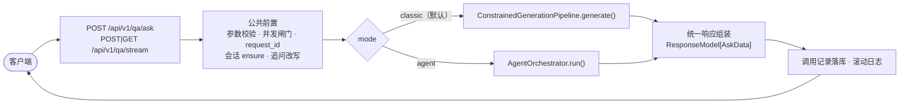

# 03 · 双模式兼容

统一入口、统一响应结构、运维设施复用。

**目标**：Agent 模式是**新增的一条分支，不是替换**。现有调用方一行不改仍照旧工作。

---

## 一、入口层路由



**要点**：分叉只发生在一处，且**在公共前置之后**。参数校验、并发闸门、`request_id` 生成、
会话关联、追问改写这些对两种模式完全一致，不重复实现。

⚠ 流式路径的分叉必须同样在**返回 `StreamingResponse` 之前**完成。
现有约束：SSE 一旦开始 yield，状态行已发出，就再也没法表达 HTTP 层的失败。
所以模式选择、参数校验、闸门这些必须在流开始前做完。

---

## 二、入口参数

在现有 `AskRequest` 上**新增三个字段**，其余一个不动：

```python
class AskRequest(BaseModel):
    # ── 现有字段全部保留，语义不变 ──────────────────────────
    query: str
    top_k: int = 10
    session_id: Optional[str] = None
    history_turns: int = 4
    rewrite: Optional[str] = None
    evaluate: bool = True
    review: bool = True
    constrained: bool = True
    expect_refusal: Optional[bool] = None
    evidence_pool: Optional[str] = None
    include_intermediate: bool = False

    # ── 新增 ───────────────────────────────────────────────
    mode: str = Field("classic",
        description="执行链路：classic=原有 RAG 流水线（默认）；agent=Agent 执行链路")
    max_rounds: Optional[int] = Field(None, ge=1, le=5,
        description="仅 agent 模式：最大迭代轮次；缺省用服务端配置（默认 3）")
    include_trace: bool = Field(False,
        description="仅 agent 模式：是否返回完整执行轨迹（体积大，默认不返回）")
```

### 默认值的选择

| 参数 | 默认 | 理由 |
|---|---|---|
| `mode` | `"classic"` | **默认不变行为**。现有 18 个接口的全部调用方、Postman 集合、演示台本、229 项验证都不受影响 |
| `max_rounds` | `None` → 服务端配置（3） | 与现有做法一致：CLI 参数一律 `default=None`，真正的默认值只在 `ServiceSettings` 写一份。写死在这里会让 `.env` 与环境变量永远轮不到 |
| `include_trace` | `False` | 对齐现有 `include_intermediate` 的处理——体积大的东西默认不返回 |

⚠ `mode` 用字符串而不是布尔 `use_agent`：将来若出现第三种链路（如纯检索无生成），
布尔字段就得推翻重来。字符串在同一个字段里扩展。

### 服务端配置

新增两项，走现有四层优先级（**CLI > 环境变量 > `.env` > 默认值**）：

| 配置项 | 环境变量 | 默认 |
|---|---|---|
| 默认执行模式 | `MEDRAG_DEFAULT_MODE` | `classic` |
| Agent 最大轮次 | `MEDRAG_AGENT_MAX_ROUNDS` | `3` |

⚠ 加进 `ENV_FIELDS` 表即可，`.env.example` 由 `--write-env-example` 从代码生成，
不会与代码脱节（现有机制）。

---

## 三、统一响应结构

### 外层完全不变

```python
ResponseModel[AskData]      # code / message / data / detail / request_id / timestamp / elapsed_ms
```

`ResponseModel` 是泛型，`data` 换成扩展后的 `AskData` 即可，
`code == 0` 判成功这套语义、21 个错误码、四个全局异常处理器**全部照旧**。

### `AskData` 新增四个字段，现有字段语义一律不变

```python
class AskData(BaseModel):
    # ── 现有字段：语义完全不变 ─────────────────────────────
    request_id: str
    session_id: Optional[str]
    query: str
    resolved_query: str
    retrieval_query: Optional[str]
    rewritten: bool
    partial: bool                 # 部分作答；与 refused 互斥
    history_used: int
    answer: str
    refused: bool                 # 完全拒答
    retrieval_mode: str
    evidence_pool: Optional[str]
    sources: List[SourceItem]
    citation_check: Optional[CitationCheck]
    constraint_check: Optional[ConstraintCheck]
    metrics: GenerationMetrics
    intermediate: Optional[Dict[str, Any]]

    # ── 新增：classic 模式下全部为 null / 默认值 ───────────
    mode: str = "classic"
    agent: Optional[AgentSummary] = None
    execution_trace: Optional[List[Dict[str, Any]]] = None   # include_trace=true 才返回
    plan: Optional[Dict[str, Any]] = None                     # 结构化子任务列表
```

```python
class AgentSummary(BaseModel):
    """Agent 执行摘要。体积小，agent 模式下恒返回。"""
    rounds_used: int = 0
    max_rounds: int = 3
    replan_used: int = 0
    strategy: str = ""                    # factual / comparative / temporal_causal
    subtasks_total: int = 0
    subtasks_covered: int = 0             # 有证据的子任务数
    subtasks_empty: int = 0
    tool_calls: int = 0
    cache_hits: int = 0
    evidence_total: int = 0               # 证据池条数
    evidence_used: int = 0                # 最终进上下文的条数
    terminated_by: str = ""               # sufficient / budget_exhausted / timeout / tool_failure
    expected_refusal_state: str = ""      # Agent 的期望值
    actual_refusal_state: str = ""        # 校验器的判定 ← 以此为准
```

### 两条兼容性硬约束

**1. `refused` 与 `partial` 的语义在两种模式下完全一致。**
Agent 模式**不新增拒答状态**，仍由 `FormatChecker.check_refusal()` 判，
作用域仍是「核心答案」一节。`AgentSummary` 里的 `expected_refusal_state` 只作对照，
不参与判定。

**2. `sources` 与 `citation_check` 的形状不变。**
多轮检索后 `[S#]` 由全局分配器统一分配（见 `01_核心架构.md` §8），
所以 `sources` 仍是一个扁平列表，`citation_check` 仍是 used / available / fabricated 三集合。
**客户端不需要知道证据来自第几轮**——需要时看 `execution_trace`。

### 客户端迁移成本

| 客户端行为 | 影响 |
|---|---|
| 不传 `mode` | 走 classic，**行为与今天逐字相同** |
| 只读 `answer` / `sources` | 两种模式一致，无需改动 |
| 读 `refused` / `partial` | 语义一致，无需改动 |
| 想用 Agent | 传 `mode=agent`，可选读 `agent` 摘要 |

---

## 四、复用现有运维设施

### 4.1 日志

| 设施 | 现有模块 | Agent 侧怎么用 |
|---|---|---|
| 滚动日志（10MB × 5，行首带 `request_id`） | `服务_日志.py::configure_logging` | 直接用。Agent 各环节的日志同样带 `request_id`，与 classic 模式混在同一份日志里可按 id 串起来 |
| `request_id` 贯穿 | 现有 `contextvars` | 直接用。⚠ 同步路由丢进线程池时 `contextvars` 会随 `anyio.to_thread.run_sync` 复制过去——这条已实测确认，Agent 编排器同样跑在同步路由里，行为一致 |

**新增的只有一条约定**：Agent 环节日志加统一前缀 `[agent:<环节>]`
（`[agent:plan]` / `[agent:exec]` / `[agent:reflect]` / `[agent:merge]`），
便于 `grep`。不改日志配置。

### 4.2 监控与调用记录

| 设施 | 现有模块 | Agent 侧怎么用 |
|---|---|---|
| 调用记录落库 | `服务_日志.py::CallLogStore` | 直接用。`CallLogItem` 现有字段（`elapsed_ms` / `llm_calls` / `prompt_tokens` / `refused` / `compliant`）语义在 Agent 下完全成立 |
| 运营统计 | `/qa/stats` → `CallStats` | 直接用。成功率 / 拒答率 / 合规率 / p50 / p95 的口径不变 |

**建议新增两列**（可选，不加也能跑）：`mode`（classic/agent）与 `rounds_used`。
理由：不分模式统计会把两种链路的耗时混在一起，p95 变得不可解释——
Agent 模式天然更慢，混算会让 classic 的指标看起来退化。

⚠ `CallLogItem` 已有 `mode` 字段，但当前语义是 `sync / stream`。
**不要复用它**装 classic/agent——一个字段两种语义是「字段名必须承诺真实语义」那条的反例。
新增独立列，或改名区分。

### 4.3 缓存

| 层 | 现有模块 | Agent 侧怎么用 |
|---|---|---|
| 生成结果缓存 | `生成_缓存.py::GenerationCache` + `CachedLLMGenerator` | 最终整合的四段链直接复用，与 classic 模式共用同一实例 |
| 工具结果缓存 | 同一个类，不同 `namespace` | `namespace="tool:retrieval.search"`，与生成缓存分区，避免互相挤占容量上限 |

⚠ **缓存键必须含全部影响结果的检索参数**（`top_k` / `rerank_pool` / `fusion_strategy` /
`use_landmark`）。Agent 会按子任务用不同参数调同一个 query，漏参数会误命中。

⚠ 温度门限默认 `max_temperature = 0.0`：检索工具是确定性的（实测同输入三轮逐位相同），
可正常缓存；规划/反思若用非零温度则不缓存，这是既定行为，不是 bug。

### 4.4 健康检查

`/health/ready` 现有 7 个组件。Agent 模式**不新增关键组件**——
它依赖的检索器、Ollama、会话库、调用记录库都已在探针里。

建议在 `HealthData` 加一个非关键项 `agent:ready`（报告默认模式与最大轮次配置），
`critical=False`，不影响 `status` 判定。

⚠ 现有验证脚本按**组件名**断言而非按数量，所以加一个非关键组件不会让交付包在别人机器上变红。
但文档里若写「共 N 个组件」，那个 N 没有测试保护——这条已在现有系统上踩过一次。

---

## 五、不改动清单

明确列出**不动**的东西，便于评审时确认影响面：

| 不动 | 原因 |
|---|---|
| `ConstrainedGenerationPipeline` / `MedicalGenerationPipeline` | Agent 复用它们，不改一行 |
| `FormatChecker` 的 19 个违规码与三态 | Agent 不新增违规码 |
| `ContextAssembler` 的去重 / 多样性 / 预算逻辑 | 只扩展 marker 入口，不动渲染 |
| `RetrievalPipeline.search()` 签名 | 参数已足够，工具层在外面包一层即可 |
| 21 个错误码与五族分段 | 工具失败映射到现有 4xxx / 5xxx |
| `ResponseModel` 外层 | 泛型，换 `data` 即可 |
| 现有 18 个接口的路径与语义 | 只在 `/qa/ask` 与 `/qa/stream` 加请求字段 |

**唯一需要新增错误码的可能场景**：工具执行失败是否要独立成段（如 `6xxx`）。
本方案的选择是**不新增**——映射到现有 `4001`（调用失败）/ `4002`（超时）/
`3004`（索引未就绪）/ `5002`（依赖失败）已能覆盖，且保持码表稳定比表达精确更值。
若将来注册了非模型类工具（计算器、结构化查询），再评估。

---

## 六、流式模式下的 Agent

Agent 模式同样支持 SSE，但事件序列更长。沿用现有七种事件，**新增三种**：

| 事件 | 何时发 | 载荷 |
|---|---|---|
| `plan`（新增） | 规划完成 | 子任务列表与策略 |
| `round`（新增） | 每轮结束 | 轮次号、本轮新增证据数、反思结论 |
| `trace`（新增） | 仅 `include_trace=true` | 扁平事件 |
| `sources` | 最终整合后 | 与 classic 一致 |
| `done` | 结束 | 载荷与 `AskData` 字段一致（现有约定） |

⚠ 两条现有约束在 Agent 下依然成立：

1. **最终答案以 `done` 为准**，`delta` 只是过程量。
2. **流式请求的耗时中间件量不到**（它在响应头发出那刻就停表），
   要由流生成器自己收尾时写——Agent 模式耗时更长，这条更重要。

⚠ **Agent 模式下「首个事件」的时机变了**：classic 模式出处清单 0.03 s 就能推给客户端；
Agent 模式要等规划完成（约 5 s）才有第一个 `plan` 事件，
出处要等最终整合（可能 40 s+）。这是真实的体验退化，
建议前端在 Agent 模式下先渲染 `plan` 事件填充等待期——
与现有「流式的价值是把等待期填上真实信息」是同一思路。
